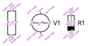

# Circuitor for Typst


> [!IMPORTANT]
> Circuitor is not yet available on Typst Universe. Follow [this discussion](https://github.com/l0uisgrange/circuitor/discussions/2) to stay updated on the first release 🌟!

**Circuitor** is a lightweight ⚡️ Typst package that makes drawing electronic circuits simple and intuitive. It is also the first library designed to align with widely recognized standards 📜 like IEC and IEEE/ANSI.

```typst
#import "@preview/circuitor:0.1.0"

#circuitor.canvas({
    import circuitor: *

    isource("i1", (0,0), (5,0))
    resistor("r1", (5,5), (0,5))
    wire("r1.out", "i1.minus")
})
```

## Documentation

Comprehensive documentation 📚, including easy-to-navigate sections, examples, a component list, and API references, is available [online here](https://l0uisgrange.github.io/circuitor/).

## Supported Components

Circuitor supports a wide range of electronic components 🤓, with symbols in different variants. 

It includes `resistor`, `led`, `diode`, `capacitor`, `vsource`, etc. The complete list of available components with examples and documentation can be found on the [online documentation](https://l0uisgrange.github.io/circuitor/docs/components).

Feel free to suggest 💡 any new component by [opening a new issue](https://github.com/l0uisgrange/circuitor/issues/new?template=new_component.yml)!

### Standard Variants

> [!NOTE]
> The representation for each symbol adheres closely to the relevant standard. The current implementations are based on
> - [IEC 60617](https://webstore.iec.ch/en/publication/2723) (January 1st, 2025) **recommended standard worldwide** 🌎
> - [IEEE/ANSI 315–1975](https://standards.ieee.org/ieee/315/515/) (deprecated as of November 7th, 2019)

Each component can be displayed using either the IEEE/ANSI, or IEC symbol style. For example, here are the resistor variants:


### Magic Anchors

Circuitor is built on top of CeTZ, allowing you to combine CeTZ shapes and your circuit elements on the same canvas seamlessly. CeTZ allows the use of [anchors](https://cetz-package.github.io/docs/basics/coordinate-systems/#anchor) too, for a very easy placement of labels and components.



## Contributing

I highly welcome contributions 🌱! Creating and maintaining `circuitor` takes time and love. If you'd like to help, check out the [contribution guidelines](CONTRIBUTING.md) and join the journey 🤩!
